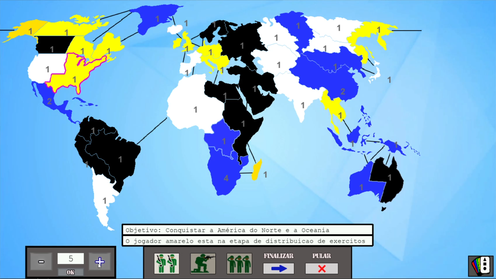
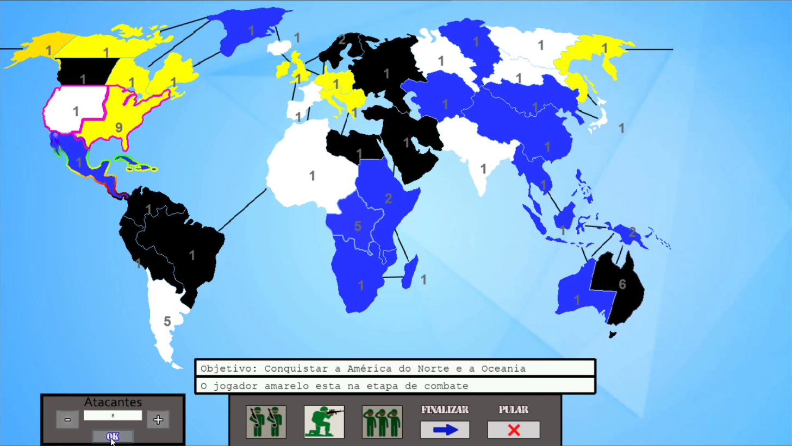
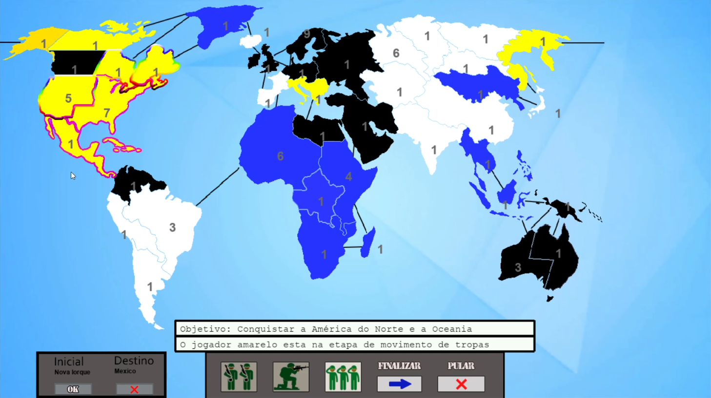
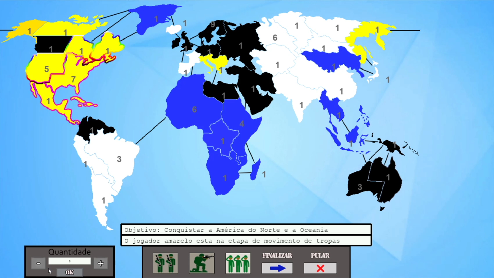
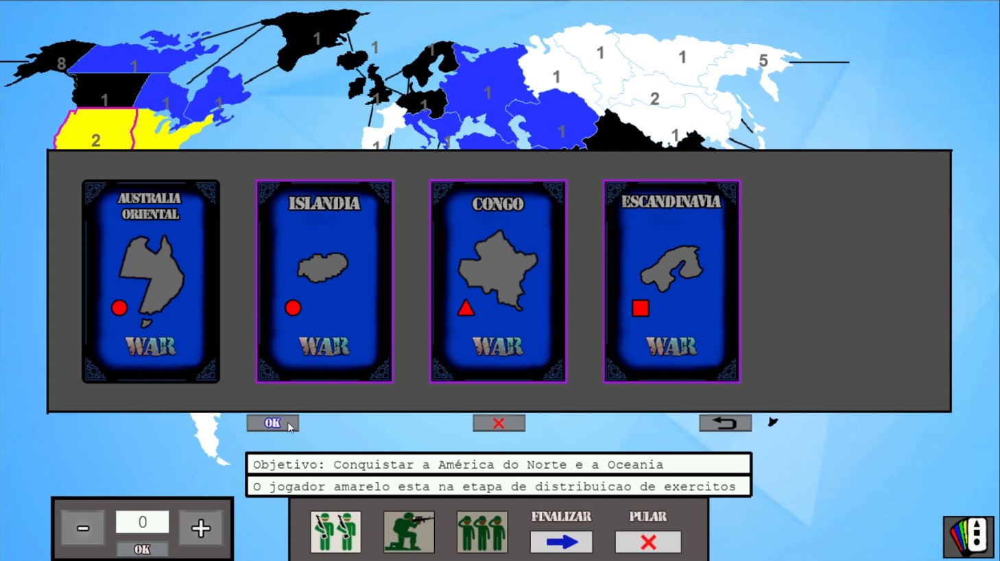

# Jogo WAR para desktop

Para executar o jogo, basta dar um duplo clique no executável de nome “main”, que está na pasta compactada WAR.zip entregue, ou na pasta WAR neste repositório. Precisamos montar uma pasta desse jeito para ter acesso aos arquivos do código.

## Passos para a inicialização do Jogo:
1. No menu que abre no início do jogo, selecione partida local. (A implementação do jogo online não foi feita, então, apesar de ser possível fazer login, cadastro, criar salas e entrar em uma sala, não é possível criar uma partida online.)
2. Na tela seguinte selecione o número de bots(Controlados pela IA) e o número de players(Controlados por humanos). O jogo deve possuir um mínimo de 4 jogadores e máximo de 6, onde pelo menos um deles é humano.

## Jogabilidade:
O jogo mostra na interface qual é o objetivo do jogador atual e em qual etapa do turno ele está.
* Distribuição de tropas:
   1. No início do jogo, cada jogador deve distribuir tropas entre seus territórios.
   2. Selecione o território onde deseja distribuir as tropas.
   3. aparecerá uma interface na esquerda. Selecione a quantidade de tropas através dos botões “+” e “-” e clique em OK.
   4. Se ainda houver tropas para distribuir volte ao passo 2, caso contrário, clique em finalizar.

Tela de distribuição de tropas.
  
* Combate:
   1. Após a distribuição de tropas, ocorrerá a etapa de combate.
   2. Se o jogador não quiser combater, clique em finalizar. 
   3. Se o jogador não quiser tomar mais nenhuma ação no turno(Inclusive movimentação de tropas), selecione pular.
   4. Para realizar um ataque, selecione algum de seus territórios. 
   5. O jogo irá destacar os possíveis territórios a serem atacados.
   6. selecione o território para atacar.
   7. selecione a quantidade de tropas utilizadas no ataque com os botões “+” ou “-” e depois clique em Ok.
   8. Se ainda desejar atacar, volte ao passo 4, caso contrário clique em finalizar.
   

Tela de escolher ataque.
  

Tela de escolher tropas para o ataque.
  
* Movimentação de tropas:
   1. Após o combate, o jogador poderá movimentar tropas entre os seus territórios.
   2. Analogamente ao combate, selecione um território de sua posse.
   3. O jogo irá destacar os territórios disponíveis para receber movimentação.
   4. Selecione o território que receberá as movimentações.
   5. Selecione a quantidade de tropas na interface ao lado esquerdo.
   6. selecione OK.
   7. Se ainda deseja movimentar tropas, volte ao passo 3.

Tela de escolher para onde deslocar as tropas.
  

Tela de escolher quantas tropas para deslocar.
  
* Troca de Cartas:
   1. Ao conquistar ao menos um território na etapa de combate, o jogador recebe uma carta.
   2. Durante a etapa de distribuição de tropas, o jogador pode selecionar o ícone do canto inferior direito para verificar quais cartas possui. 
   3. Para trocar cartas, selecione 3 cartas na sua mão e selecione o OK.
   4. O jogador irá receber a quantidade de tropas correspondentes às cartas trocadas para distribuir no mesmo turno.

Tela de escolher quais cartas trocar.
  
